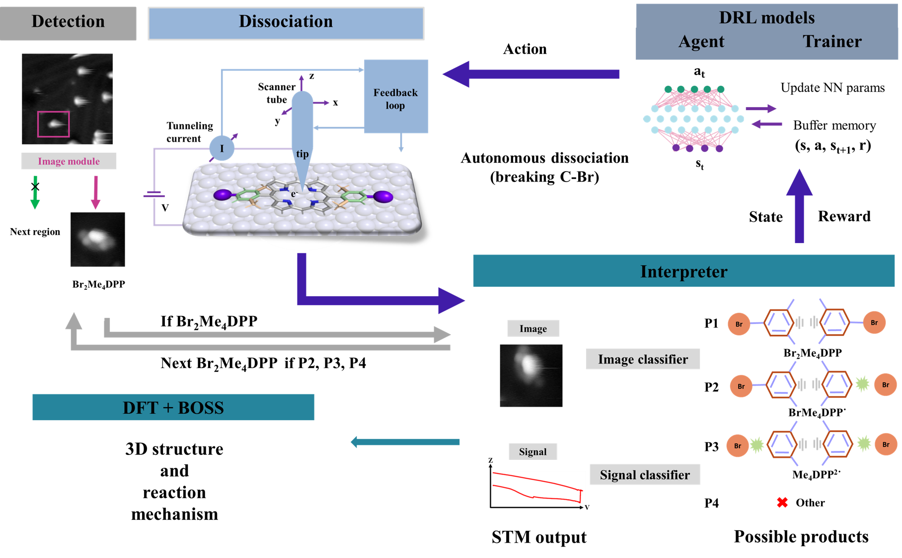
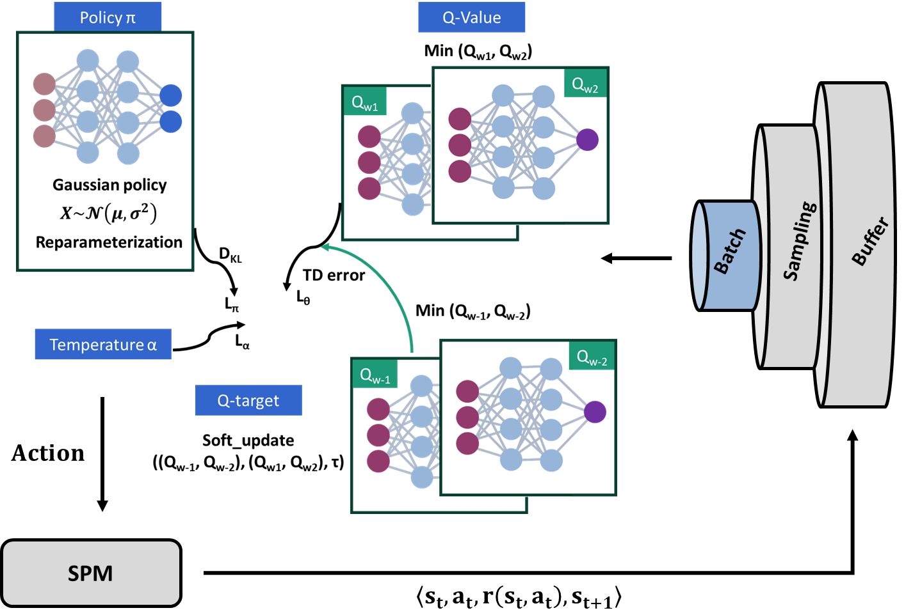
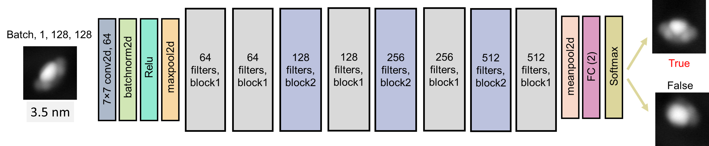

# Auto_Reaction_STM


We developed the framework of AutoOSS (Autonomous on-surface synthesis) to automate chemical reactions (breaking C-Br) in scanning tunneling microscopy. It comprises the remote connection, target dection module, interpetation module (image classifiers to identify reactants and products), decision-making module to optimize parameters as well as various analysis scritps. 


# Installation

## Install from package

1. Clone the repository:
   ```sh
   git clone https://github.com/Meganwu/AutoOSS.git

2. Navigate to the main directory
   cd AutoOSS

3. Install dependenceies
   pip install -r requirements.txt

## Install from 'conda install'

conda install -c your-anaconda-username your-package-name


# Usage

## env_module
 It consists of the interface to remote connection to STM/AFM software to monitor STM, target detection.

## rl_module
The reinforcement learning module aims to optimize manipulation parameters.

## img_module

Neural network models based on ResNet18 can be applied to identify reactants and products, where bayesian optimization technique is used to optimize hyperparameters like learning rate.

## params
The optimized neural network parameters of image classifiers were uploaded to evalute the protrusion in STM images.

## task_script
It includes the script to show all dissociation cases with images and signal curves, to submit tasks, and all analyses in the manuscript. 


# License
MIT license


# Citation
If you use AutoOSS repository, please cite the following paper:
